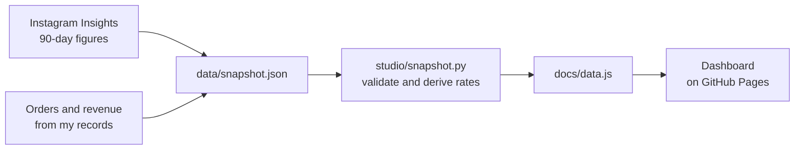

<h1 align="center">🌸 Whos Studio Analytics</h1>

<p align="center">
  A small data pipeline and dashboard that shows how Instagram attention turns into orders for my handmade brand.
</p>

<p align="center">
  <a href="https://janhaviik.github.io/My-Brand-Analytics-Platform/"></a>
  
  
  
  
</p>


## 💡 Why I built this

I run [whosstudio.co](https://whosstudio.co) on my own: I make the products, answer the DMs, and track the sales. I wanted one place that answers a simple question: **what turns Instagram attention into orders?** So I built the pipeline and dashboard myself, with real data from my shop.

## 📊 At a glance (2 Jul to 29 Sep 2026)

| What | Number |
|---|---|
| Orders | 30 |
| Revenue (approx.) | ₹21,500 |
| Average order (approx.) | ₹717 |
| Accounts reached | 23,947 |
| Profile visits | 2,503 (10.5% of viewers) |
| Orders per profile visit | 1.2% |
| Views from non-followers | 74.7% |

Instagram figures come from Instagram Insights (90-day view). Orders and revenue are approximate totals from my own records.

## 🔍 What the numbers taught me

- About three quarters of my views come from people who don't follow me yet, and Reels reach almost all of them.
- Roughly 1 in 10 viewers visits my profile, and about 1 in 80 profile visits ends in an order.
- Four in five followers are 18 to 34, and almost 80% are in India.

## ⚙️ How it works



- **Validation:** a missing or impossible field (for example zero orders) stops the build and names the field.
- **Derived metrics:** average order, visit rate, order rate, link-tap rate and interaction rate are calculated in code, never typed in.
- **Tests:** `unittest` checks the metrics and the validation, and GitHub Actions runs them on every push.

## 🧰 Skills shown

| Area | What I used |
|---|---|
| Backend and data | Python standard library, JSON validation, derived metrics |
| Testing | `unittest`, automated runs with GitHub Actions |
| Front end | HTML, CSS and vanilla JavaScript, responsive layout, keyboard-friendly charts |
| Hosting | GitHub Pages, zero cost |
| Product thinking | Funnel analysis built from my own shop's data |

## 🚀 Run it locally

```
python -m unittest discover -s tests -v   # run the tests
python -m studio summary                  # headline numbers in the terminal
python -m studio build                    # regenerate docs/data.js
```

Then open `docs/index.html` in a browser. Needs Python 3.9 or newer, nothing else.

## 🔄 Update it

Edit `data/snapshot.json` and `data/settings.json`, run `python -m studio build`, and commit the new `docs/data.js`. Instagram only shows 90 days at a time, so I add a new snapshot every quarter.

The repo also contains an order-level mode (`studio/db.py` and `studio/analytics.py`: CSV to SQLite to monthly revenue, repeat buyers and funnel). It switches on when `data/snapshot.json` is absent and `data/orders.csv` and `data/instagram.csv` exist.

## 🗺️ Roadmap

- [x] Dashboard from real Instagram Insights and sales totals
- [x] Input validation and unit tests
- [x] Automated tests on every push
- [ ] Log every order by date and product for monthly trends and repeat-buyer rate
- [ ] Count DMs so the funnel includes the conversation step
- [ ] Rebuild on AWS (Lambda and DynamoDB) as a second version
